# <span style="color:#ADD8E6">CSCC01 Backend Lab Winter 2025</span>

<div align="right"> </div>

## <span style="color:#ADD8E6">Table of Contents </span>

- [Description](#desc)
- [Prerequisites](#pre)
- [Implementing the App](#impl)
  - [Database](#db)
  - [Backend](#bcknd)
- [Your Task](#task)

<a id="desc"></a>

## <span style="color:#ADD8E6"> Description </span>

This is a two part lab where you will learn how to build a simple full stack web application using PostgreSQL, ExpressJS, React.js, and Node.js, and you will build upon this application. Here's a brief overview of all the technologies you will explore in this lab:

### PostgreSQL

PostgreSQL is a powerful, open-source relational database system that supports SQL queries, scalability, and ACID compliance. We will use PostgreSQL as our database.

### Express.js

Express.js is a minimal and flexible Node.js web application framework that simplifies the creation of robust APIs and web applications, offering a range of features for routing, middleware, and HTTP utility methods.

### Node.js

Node.js is a server-side JavaScript runtime, enabling the execution of JavaScript code on the server, facilitating the development of scalable and high-performance network applications. We will use Node for our backend.

### Postman

Postman is a widely-used collaboration platform that simplifies the process of developing, testing, and documenting APIs. It provides a user-friendly interface for sending HTTP requests, inspecting responses, and managing API development workflows, making it a valuable tool for developers and teams working on API-related tasks.

Please refer to the officials docs and API references for more information:

- https://nodejs.org/docs/latest/api/
- https://expressjs.com/en/4x/api.html
- https://www.postgresql.org/docs/

If there are any issues or inaccuracies, please contribute by raising issues, making pull requests, or asking on Piazza. Thanks!

In this part of the lab we will focus on writing a Web API from scratch in Node using the Express.js framework and storing our data in a local PostgreSQL database. We will learn to test our API using an HTTP client such as Postman.

<a id="pre"></a>

## <span style="color:#ADD8E6"> Prerequisites </span>

1. **Make sure you have Node.js (>= v20.6.0) installed**. You can install from the official website: https://nodejs.org/en/download/
2. We will be using a local PostgreSQL database, refer to this link for a quick tutorial to install PostgreSQL on most platforms: https://www.prisma.io/dataguide/postgresql/setting-up-a-local-postgresql-database and install it from here: https://www.postgresql.org/download/ 
3. Note: Please remember the password you set for the postgres superuser when installing, we will need to use this later. 
4. An HTTP client to craft HTTP requests. We will use Postman. You can download Postman here: https://www.postman.com/downloads/
5. An IDE. We will use VS Code.

Some important notes:

- For this lab, we are making the assumption that students will be utilizing the latest version for each of these technologies. If you are encountering issues, please try updating first (if required), or ask a TA for help during tutorials or on Piazza if further assistance is still needed.
- During the installation tutorial above, you might see usage of PostgreSQL 12.x. The latest version of PostgreSQL is 17.2 (as of time of writing), so adjust any neccessary commands accordingly.
- Please use **at least version v20.6.0** of NodeJS or env files won't work!

<a id="impl"></a>

## <span style="color:#ADD8E6"> Implementing the App </span>

Initialize a new GitHub repo named appropriately, and clone it locally. This repo includes starter code (available within the `backend` folder) that will be used for the lab, but we will teach you how to recreate this starter code from scratch throughout the rest of this `README` file.

Navigate to the root of your project and create a new directory named `backend-example`. We will only work inside this folder for the rest of the tutorial. Run `cd backend-example` to navigate to the backend directory.

<a id="db"></a>

### <span style="color:#ADD8E6"> Database </span>

We will set up a local server to run for a local PostgreSQL database. If you followed the installation instructions above, you should be able to find a `psql` application on your system. Run that to open a PostgreSQL shell, and hit **Enter** to accept the default values for everything other than the password, for which you should enter the postgres default user password you created during installation! 

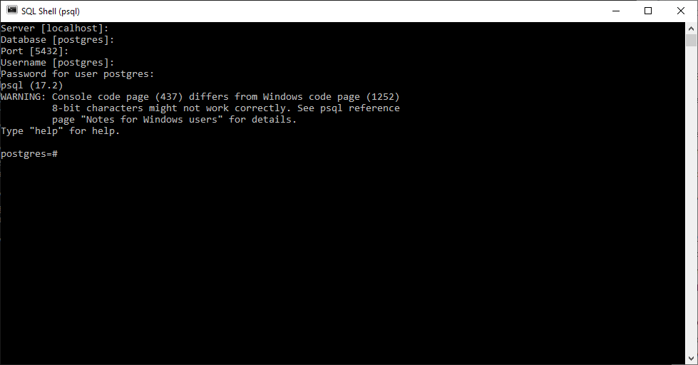

We can create the database and schema using the following commands:

```shell
CREATE DATABASE quirknotes;
```

```shell
\c quirknotes;
```

```shell
CREATE TABLE users (
  id SERIAL PRIMARY KEY,
  username VARCHAR(50) NOT NULL UNIQUE,
  password TEXT NOT NULL
);

CREATE TABLE notes (
  id SERIAL PRIMARY KEY,
  title VARCHAR(100) NOT NULL,
  content TEXT NOT NULL,
  user_id INTEGER REFERENCES users(id)
);
```
 _Do not close this terminal!_ It will be the main point of contact with your database's storage.
 
 **NOTE:** We will test your code using a database with an identical schema. Do not change it.

 If you need a refresher on SQL basics, and to see some of the basic PostgreSQL commands, see this cheatsheet: https://quickref.me/postgres.html. 

<a id="bcknd"></a>

### <span style="color:#ADD8E6"> Backend </span>

1.  We will use Node.js to set up our backend server. On a terminal different from the one before, run `npm init` while inside the `backend-example` folder. For the entrypoint option enter: `server.js` and press enter to select the default option for everything else:

    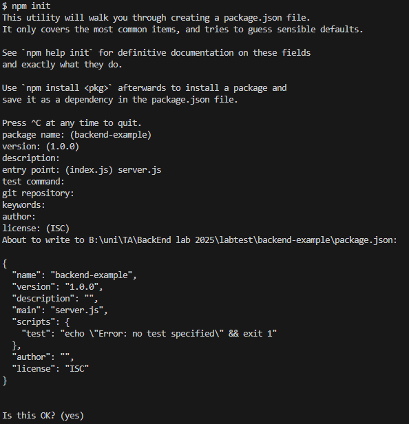

`server.js` will be the entrypoint file for our backend application. Now you should see a `package.json` file created, which holds important information about the project (including name, entrypoints, scripts, dependencies, etc). Open this file in an IDE and add the following line under `"scripts"`:

```js
"start": "node --env-file=.env server.js",
```

This is a start script for our app, i.e. running `npm start` in this directory should run this command.

Below the scripts object, add `"type": "module"` as shown below:

```js
{
  ...
  "scripts": {
    ...
  },
  "type": "module",
  ...
}
```

This allows us to use a specific standard for writing Javascript ([ECMAScript](https://en.wikipedia.org/wiki/ECMAScript#:~:text=ECMAScript)).

2. Within your terminal, while you're in the `backend-example` directory, run:

```
npm install express pg bcrypt jsonwebtoken
```

[Express.js](https://www.npmjs.com/package/express), [a PostgreSQL driver](https://www.npmjs.com/package/pg), [Bcrypt](https://www.npmjs.com/package/bcrypt) and [jsonwebtoken](https://www.npmjs.com/package/jsonwebtoken) are the dependencies we are going to need to write our backend server.
We also run

```
npm install --save-dev nodemon
```

to install [Nodemon](https://www.npmjs.com/package/nodemon) as a development dependency. Nodemon will help refresh/restart Node.js when we make changes to our `server.js` file. Technically, this is not required for our server to run, but it is important for development, so we flag it as a development dependency with `--save-dev` -- an important distinction for when we get to talking about deployment in future labs.

Inside our `package.json` file, we can add another script,

```js
"dev": "nodemon --env-file=.env server.js"
```

(The start script will be used when marking your lab, but you can make use of this one to work on development.)

Finally, create a file called `.env` in `backend-example`. We will put environment variables like our connection strings to PostgreSQL in here. It's always good practice to separate credentials and API keys into environment variables, which can be injected into an application on startup.
```
PG_HOST="localhost"
PG_PORT=5432
PG_USER="postgres"
PG_PWD={YOUR_POSTGRES_PASSWORD}
PG_DATABASE="quirknotes"
```
Note: We will inject our own values for these environment variables when testing your lab, so make sure you have these set up.

3.  Next, create and open up a `server.js` file, and add the following imports:

```js
import express from "express";
import pg from "pg";
const { Pool } = pg;
import bcrypt from "bcrypt";
import jwt from "jsonwebtoken";
```

- `express` imports the `Express.js` framework from the `express` package.
- `Pool` is used to create a pool of database interaction clients which we will use to interact with our PostgreSQL database in Node.
- `bcrypt` will act as the algorithm designed to encrypt and hash passwords that we will eventually need for an userbase system.
- This, alongside `jwt` will help us build a basic authentication/authorization system for our MERN application.

4. Now we will initialize our Express app and connect to our database. Ensure your local PostgreSQL instance is still running on port 5432, and add the following lines to your `server.js`:

```js
const app = express();
const PORT = 4000;
```

and

```js
// Connect to PostgreSQL
let pool;

async function connectToPG() {
  try {
    pool = new Pool({
      user: process.env.PG_USER,
      host: process.env.PG_HOST,
      database: process.env.PG_DATABASE,
      password: process.env.PG_PWD,
      port: process.env.PG_PORT,
    });
  } catch (error) {
    console.error("Error connecting to PostgreSQL:", error);
  }
}

connectToPG();
```

In the first chunk of code we initialize a new express app and store in the `app` variable for reference. We will define the `PORT` to use as 4000.

The second chunk of code uses the Pool object along with the environment variables we defined to connect to our database.

At this point in time, you should be able to run `npm run dev` in a terminal to use Nodemon to see your server in action.

```
> backend-example@1.0.0 dev
> nodemon server.js

[nodemon] 3.1.9
[nodemon] to restart at any time, enter `rs`
[nodemon] watching path(s): *.*
[nodemon] watching extensions: js,mjs,cjs,json
[nodemon] starting `node --env-file=.env server.js`
```

You can keep this terminal active, it will refresh when you save new changes in your `server.js` file.
From this point forward, if there's any code in the tutorial that needs to be placed in the `server.js` file, you are free to save the file right afterwards.

5. Add the following to your code:

```js
// Open Port
app.listen(PORT, () => {
  console.log(`Server is running on http://localhost:${PORT}`);
});
```

This will set up the server itself on port `4000`. After you save, you should now be able to see the terminal from above change. Alongside this, you are now able to open Postman and test that the server is indeed open and available:
Launch Postman and open a new tab as you see the Overview. You should see a new window where you can create a new HTTP request.
Input `http://localhost:4000`, the URL for our server and click `Send`.

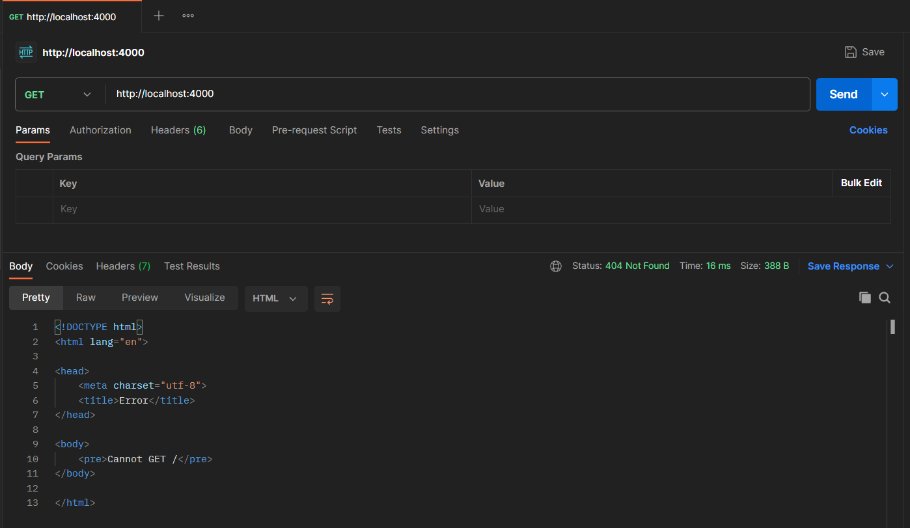

If the server responds with an error, that means it is actively running and listening for requests. We have yet to define endpoints and backend logic, so this response is normal.

6. Given we are going to need a userbase, we can start setting up the endpoint required to input an username and password for an incoming user. 

Add the following to your code:
```js
// Register a new user
app.post("/registerUser", express.json(), async (req, res) => {
  try {
    const { username, password } = req.body;

    // Basic body request check
    if (!username || !password) {
      return res
        .status(400)
        .json({ error: "Username and password both needed to login." });
    }

    // Return a valid response
    res.json({ response: `Here's your username: ${username}` }); //Implicitly status 200
  } catch (error) {
    res.status(500).json({ error: error.message });
  }
});
```

You're free to take a little bit of time to understand this function thoroughly. It introduces a lot of important aspects for endpoints:
The chunk of code defines an Express POST endpoint with the route `/registerUser`. There is an `express.json()` middleware function that helps with parsing requests that are explicitly using a JSON format. This is defined through the `Headers` portion of an HTTP request ([headers](https://developer.mozilla.org/en-US/docs/Web/HTTP/Headers) often help communicate important properties of HTTP requests):

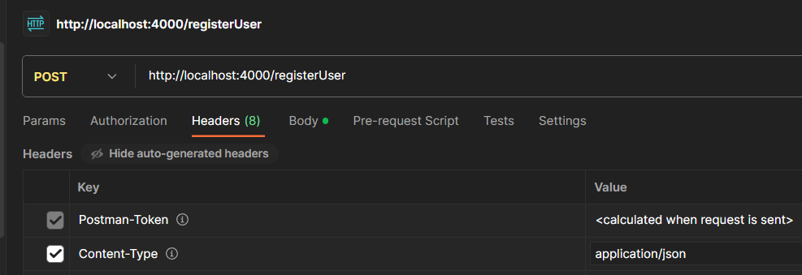

The right [HTTP status](https://developer.mozilla.org/en-US/docs/Web/HTTP/Status) also helps convey important information about an endpoint, and whether a request was successful or not.
The `req` variable contains request information such as the `req.body`, usually in JSON format. This endpoint requires the body of the request to contain at least two values named `"username"` and `"password"`.
Going back to Postman, change the request type to `POST` and enter the following URL in the textbox: `http://localhost:4000/registerUser`. Now navigate to the "Body" tab and select "raw" as well as "JSON" from the little dropdown.
In the body textbox enter JSON data that contains an username and a password. For e.g:

```JSON
{
  "username": "C01Lover",
  "password": "ilovec01"
}
```

Finally hit `Send`. If all goes well, you should receive a response back from the server similar to this:

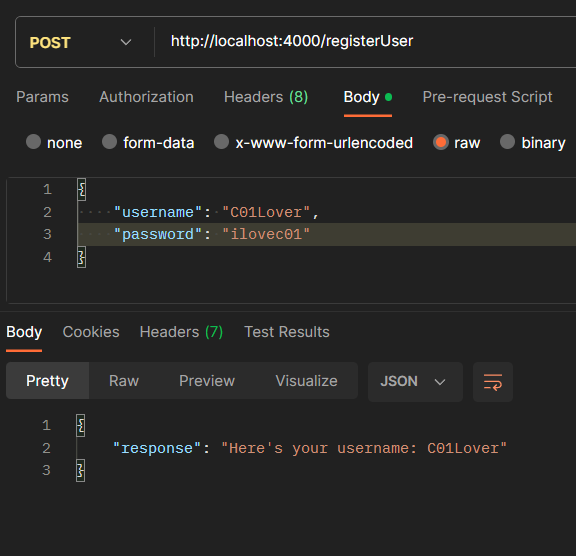

(You're free to try and see what happens if you don't have both username and password, or if you send an invalid JSON.)

We can now _replace_ our function with something more complex to finish the endpoint:

```js
// Register a new user
app.post("/registerUser", express.json(), async (req, res) => {
  try {
    const { username, password } = req.body;

    // Basic body request check
    if (!username || !password) {
      return res
        .status(400)
        .json({ error: "Username and password both needed to register." });
    }

    // Creating hashed password (search up bcrypt online for more info)
    // and storing user info in database
    const hashedPassword = await bcrypt.hash(password, 10);
    const result = await pool.query(
      "INSERT INTO users (username, password) VALUES ($1, $2) RETURNING id",
      [username, hashedPassword]
    );

    // Returning JSON Web Token (search JWT for more explanation)
    const token = jwt.sign({ userId: result.rows[0].id }, "secret-key", { expiresIn: "1h" });
    res.status(201).json({ response: "User registered successfully.", token });
  } catch (error) {
    res.status(500).json({ error: error.message });
  }
});
```

Given we feed the endpoint a proper username and password, it first hashes the password using bcrypt to ensure the actual password of the user is not directly stored in the database (more information found [here](https://www.topcoder.com/thrive/articles/bcrypt-algorithm)). Importantly, in our database schema we defined that username is unique, so we can rely on PostgreSQL to throw out an error if someone is attempting to register a duplicate user.

We store the user information into our database, and return a JSON Web Token upon successful user registration. This token is commonly kept by the client in some way, and used for authentication for further requests.
Go back to Postman and click `Send`. You should receive a response like this:

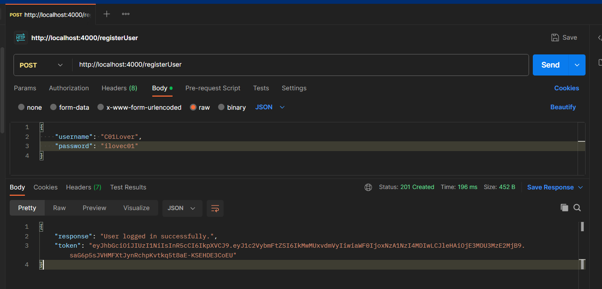

You can also confirm that your user information has been stored inside of your PostgreSQL database. Run a quick query to check:

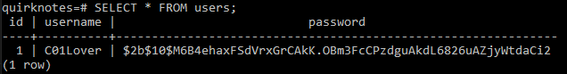


Given the response in Postman, we can now copy the token and keep it somewhere (like an open Notepad tab). On a normal application, _this would be strongly advised against_, but this is a small lab so we'll allow it. (This userbase service as a whole is meant to be small and simple.)

7. Despite you now having your token, said token is set to expire in an hour from when it was created. This is not ideal, and if this was a real server, we do not yet have the option to get that token without having to create another new account. We define an endpoint meant to help us with _logging in_, using the following code that can be put in our `server.js` file:

```js
// Log in an existing user
app.post("/loginUser", express.json(), async (req, res) => {
  try {
    const { username, password } = req.body;

    // Basic body request check
    if (!username || !password) {
      return res
        .status(400)
        .json({ error: "Username and password both needed to login." });
    }

    // Find username in database
    const result = await pool.query("SELECT * FROM users WHERE username = $1", [username]);
    const user = result.rows[0];

    // Validate user against hashed password in database
    if (user && (await bcrypt.compare(password, user.password))) {
      const token = jwt.sign({ userId: user.id }, "secret-key", { expiresIn: "1h" });

      // Send JSON Web Token to valid user
      res.json({ response: "User logged in succesfully.", token: token }); //Implicitly status 200
    } else {
      res.status(401).json({ error: "Authentication failed." });
    }
  } catch (error) {
    res.status(500).json({ error: error.message });
  }
});
```

It has a similar setup to the function we saw before, but instead of creating an entry in the userbase, we aim to find one with the username we have given in the request. Using bcrypt, we compare our request's password against the hashed password stored in our database. Only then are we able to form another token to give back to the user.
Go to Postman and change the URL to `http://localhost:4000/loginUser`. You should see a response like this after `Send`ing.

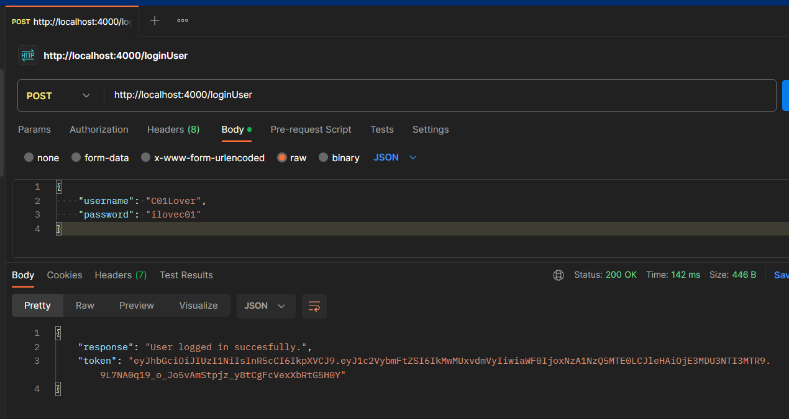

You may replace the token that you previously had with this newer one.

8. Now that we have a userbase, we can set up a basic note system for our users. For this lab, a note functions similar to a basic entry in something like Apple Notes, where there is a `title` and `content` attached to our note. The following code allows us to post notes that are attached to our user:

```js
// Post a note belonging to the user
app.post("/note", express.json(), async (req, res) => {
  try {
    // Basic body request check
    const { title, content } = req.body;
    if (!title || !content) {
      return res
        .status(400)
        .json({ error: "Title and content are both required." });
    }

    // Verify the JWT from the request headers
    const token = req.headers.authorization.split(" ")[1];
    jwt.verify(token, "secret-key", async (err, decoded) => {
      if (err) {
        return res.status(401).send("Unauthorized.");
      }

      const result = await pool.query(
        "INSERT INTO notes (title, content, user_id) VALUES ($1, $2, $3) RETURNING id",
        [title, content, decoded.userId]
      );

      res.json({
        response: "Note added succesfully.",
        insertedId: result.rows[0].id,
      });
    });
  } catch (error) {
    res.status(500).json({ error: error.message });
  }
});
```

You will notice that, alongside sending our `title` and `content` information through the body, our code is making use of an aspect in the HTTP request `headers`, with a property called `authorization`. The [Authorization header](https://developer.mozilla.org/en-US/docs/Web/HTTP/Headers/Authorization) can be used to provide credentials that authenticate a user agent with a server, allowing access to a protected resource (in this case, our note system).
In Postman, change the URL to `http://localhost:4000/note`; we can now make use of the Authorization header inside of the `Authorization` tab. If we change the type of header to `Bearer Token`, we can now make use of the token we have been holding onto this entire time by pasting it on the box on the right.

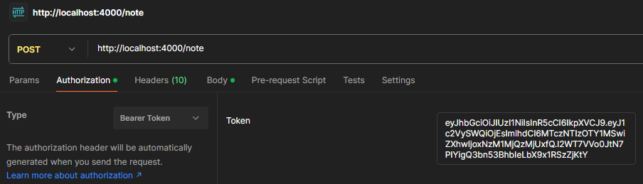

This will send our token in any further requests we make, and will help the database in identifying you as a valid user that can make notes!
If we go back to the `Body` tab in Postman, and input valid entries for `title` and `content` (in JSON format), say...

```JSON
{
    "title": "Backend development",
    "content": "Today I learnt how to set up a server!"
}
```

then we can `Send` the request and observe the results.

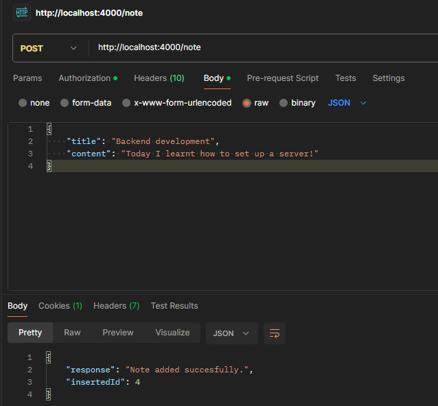

If it was successful, you will see that it has returned to you a success message and an ID. Copy and paste this ID somewhere to keep it with you! We'll need it for the last endpoint in this tutorial.
You may also verify that the note has been successfully created in our database when you take a look inside of PostgreSQL.

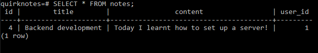

(You will notice that alongside the title and content, we see our user_id attached to it. This acts as a [_foreign key_](https://www.w3schools.com/sql/sql_foreignkey.asp) field. For this lab, it will help us identify what notes belong to which user). 

9. For our last endpoint, we will develop a way to retrieve one of our notes given an ID (the same one we were meant to hold onto).
   You may have noticed that all of our endpoints have been `POST` requests. This is because we have been making extensive use of the `body` aspect of a request. For a `GET` request, it gets [slightly more complicated](https://developer.mozilla.org/en-US/docs/Web/HTTP/Headers/Authorization):
   > Sending body/payload in a GET request may cause some existing implementations to reject the request — while not prohibited by the specification, the semantics are undefined. It is better to just avoid sending payloads in GET requests.

This endpoint is where we will try and make use of URL parameters, to get access to a specific resource.
Copy and paste the following code into `server.js`:

```js
// Retrieve a note belonging to the user
app.get("/notes/:noteId", express.json(), async (req, res) => {
  try {
    // Basic param checking
    const noteId = req.params.noteId;
    if (!Number.isInteger(Number(noteId))) {
      return res.status(400).json({ error: "Invalid note ID." });
    }

    // Verify the JWT from the request headers
    const token = req.headers.authorization.split(" ")[1];
    jwt.verify(token, "secret-key", async (err, decoded) => {
      if (err) {
        return res.status(401).send("Unauthorized.");
      }

      const result = await pool.query(
        "SELECT * FROM notes WHERE id = $1 AND user_id = $2",
        [noteId, decoded.userId]
      );

      if (result.rows.length === 0) {
        return res
          .status(404)
          .json({ error: "Unable to find note with given ID." });
      }
      res.json({ response: result.rows[0] });
    });
  } catch (error) {
    res.status(500).json({ error: error.message });
  }
});
```

Instead of checking for body parameters, we actually make use of the note ID that will be made available to us through the URL (`/getNote/:noteId`) instead (accessible through `req.params`). We verify that such an ID is an integer, and we also continue with authenticating the user as we have done for the other endpoints. Once in place, we return the user their note _if_ it exists and _if_ it belongs to them.
Go back to Postman, change the type of request to `GET`, change the URL to `http://localhost:4000/notes/[noteId]` (where `[noteId]` is the ID we have hold onto) and inside of the `Body` tab change the type to `None`. Once we `Send`, we should get something like this.

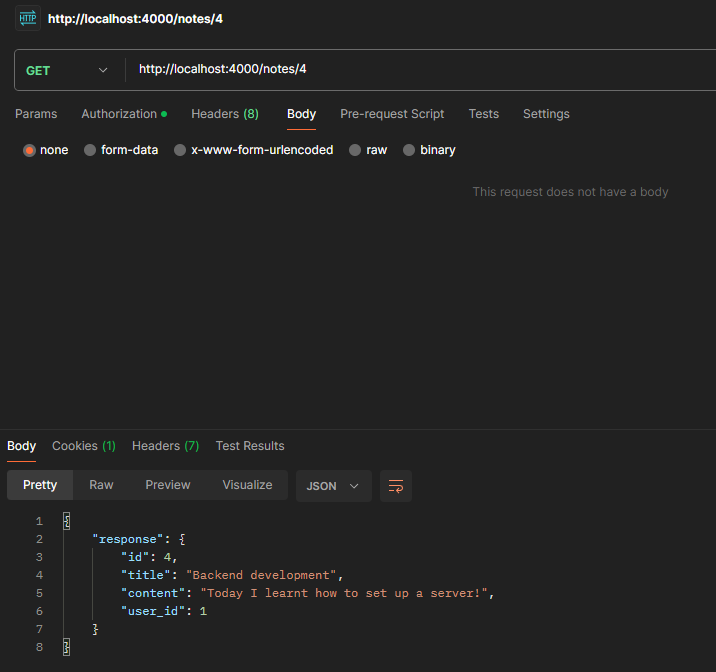

And that's all, you now have a functioning API with the ability to add and fetch data from a database: we can register + login users, and make + retrieve notes when "logged in" as a user.
There have been a few simplifications made for this lab (auth services are often not this simple!), but that should hopefully give you a good understanding of working with HTTP requests, setting up a server and endpoints, and doing some manual testing with Postman.
Of course, this is a very limited API and your job for the lab work is to expand it a little bit further.

<a id="task"></a>

## <span style="color:#ADD8E6"> Your Task </span>

Your task in this lab is to build upon this application by adding three additional endpoints to your server:

- a GET endpoint at `/notes` to retrieve all the existing notes for a specific user.
- a PATCH endpoint at `/notes/:noteId` to edit an existing note given the id.
- a DELETE endpoint at `/notes/:noteId` to delete an existing note given the id.

The specifications for the above should be available in the handout provided to you on Quercus.
_(Pssst, you can now go back to the handout! Start at step 1.)_


